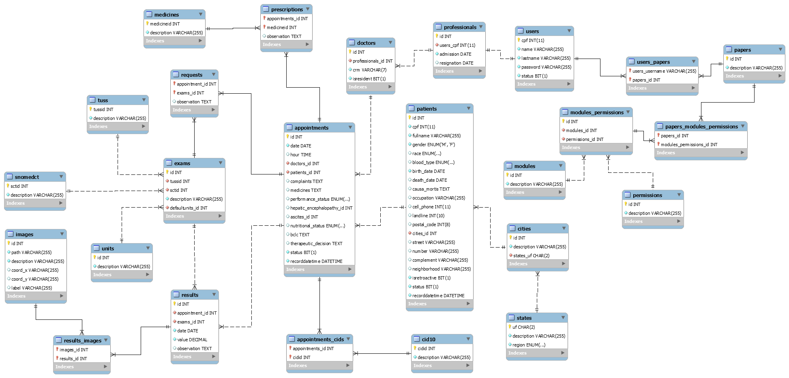

# TITULO DO PROJETO

**Nome completo do Aluno 1, email do aluno 1**

**Nome completo do Aluno 2, email do aluno 2**

**Nome completo do Aluno 3, email do aluno 3**

---

_Curso de Ciência da Computação, Unidade {Coração Eucarístico | Praça da Liberdade}_

_Instituto de Informática e Ciências Exatas – Pontifícia Universidade de Minas Gerais (PUC MINAS), Belo Horizonte – MG – Brasil_

---

_**Resumo**. Escrever aqui o resumo. O resumo deve contextualizar rapidamente o trabalho, descrever seu objetivo e, ao final, 
mostrar algum resultado relevante do trabalho (até 10 linhas)._

---

**1. Introdução**

A introdução deve apresentar de dois ou quatro parágrafos de contextualização do trabalho. 

Na **contextualização**, o aluno deve dizer do que se trata o trabalho, em que área ou contexto se insere. 
A **contextualização** deve ser desenvolvida de algo mais genérico para algo mais específico. 
A citação de pesquisas quantitativas é bem aceita aqui (corretamente referenciadas).

Em seguida o aluno deve caminhar a contextualização para descrever o **problema** que o artigo trata. 
O **problema** pode ser algo vivido em uma empresa específica.

    1.1 Contextualização
    1.2 Problema
    1.3 Objetivo geral

O aluno deve escrever um pequeno parágrafo ou frase com o **objetivo geral** do trabalho. 
O objetivo deve ser bem direto, específico e definido com verbos de ação (elaborar, propor, ava-liar, comparar etc.).

        1.3.1 Objetivos específicos

Apresente também alguns (pelo menos 2) **objetivos específicos** depende
ndo de onde você vai querer concentrar a sua prática investigativa, ou como você vai aprofundar no seu trabalho.

    1.4 Justificativas

Mostre também as **justificativas** para o 
desenvolvimento do seu trabalho e caso deseje, desta-que alguma contribuição do trabalho.

**2. Projeto da Solução**

    2.1. Requisitos funcionais
	
Enumere os requisitos funcionais previstos para a sua aplicação. 
Use a tabela abaixo para enumerá-lo.  Esses requisitos devem estar 
de acordo com as definições do modelo de negócio.

| No.           | Descrição                       | Prioridade |
| ------------- |:-------------------------------:| ----------:|
| {número       | Descrição resumida do requisito | {Alta      |
| sequencial    |                                 |  média     |
| identificador |                                 |  ou baixa  | 

    2.2. Tecnologias

Descreva qual(is) tecnologias você vai usar para resolver o seu problema, ou seja implementar a sua solução. 
Liste todas as tecnologias envolvidas, linguagens a serem utilizadas, serviços web, frameworks, bibliotecas, 
IDEs de desenvolvimento, e ferramentas.  Apresente também uma figura explicando como as tecnologias estão 
relacionadas ou como uma interação do usuário com o sistema vai ser conduzida, por onde ela passa até 
retornar uma resposta ao usuário. 

    2.3. Serviços inteligentes

Descreva o mecanismo de inteligência que será utilizado no seu sistema. Utilize a modelagem baseada em agente
para definir as entradas e saídas do seu módulo de serviço inteligente. Apresente quem irá fornecer o serviço
e em que módulo será utilizado.

	
**3. Modelagem de dados**

Apresente o modelo de dados. Defina o dicionário de dados com os respectivos formatos e significados.

    3.1. Diagrama de Entidade-Relacionamento

Apresente a estrutura das tabelas de banco de dados no modelo Diagrama de Entidade-Relacionamento. 
A Seguir, segue um exemplo de imagem adicionada ao documento.

**4. Sistema desenvolvido**

Faça aqui uma breve descrição do software e coloque as principais telas com uma explicação de como usar cada uma.

**5. Avaliação**

Faça aqui sobre a avaliação do software. Indique se ele atendeu as expectativas e ele é viável. 
Para não ficar subjetivo, o ideal é fazer um questionário e pedir ao usuário do processo que faça a avaliação.

**6. Conclusão**

Apresente aqui a conclusão do seu trabalho. Discussão dos resultados obtidos no trabalho, onde se verifica as 
observações pessoais de cada aluno. Poderá também apresentar sugestões de novas linhas de estudo.  

**REFERÊNCIAS**

**[1.1]** - _ELMASRI, Ramez; NAVATHE, Sham. **Sistemas de banco de dados**. 7. ed. São Paulo: Pearson, c2019. E-book. ISBN 9788543025001._

**[1.2]** - _COPPIN, Ben. **Inteligência artificial**. Rio de Janeiro, RJ: LTC, c2010. E-book. ISBN 978-85-216-2936-8._

**[1.3]** - _CORMEN, Thomas H. et al. **Algoritmos: teoria e prática**. Rio de Janeiro, RJ: Elsevier, Campus, c2012. xvi, 926 p. ISBN 9788535236996._

**[1.4]** - _SUTHERLAND, Jeffrey Victor. **Scrum: a arte de fazer o dobro do trabalho na metade do tempo**. 2. ed. rev. São Paulo, SP: Leya, 2016. 236, [4] p. ISBN 9788544104514._

**[1.5]** - _RUSSELL, Stuart J.; NORVIG, Peter. **Inteligência artificial**. Rio de Janeiro: Elsevier, c2013. xxi, 988 p. ISBN 9788535237016._
