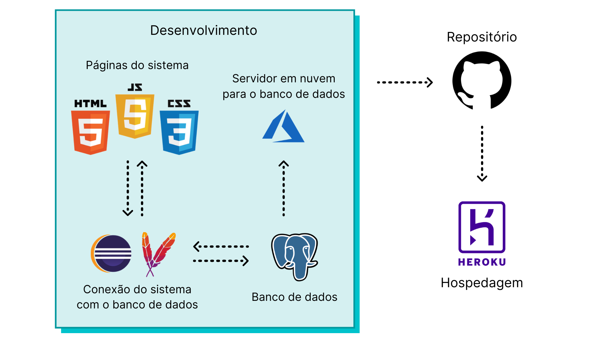
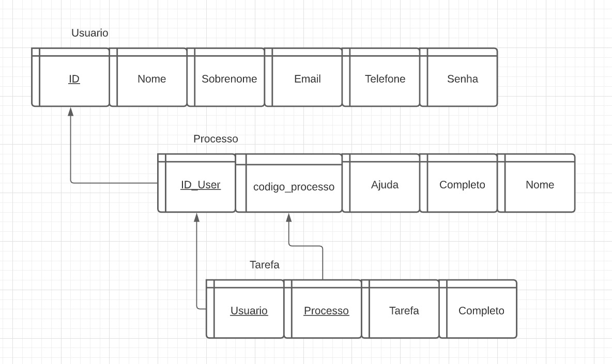

# A.DOTA

**Anna Pugga Campos Rodrigues, anna.campos@sga.pucminas.br**

**Bárbara Luiza Freitas Carmo, babi.carmo@outlook.com**

**Luiza Ribeiro Parente Silva, luizarparentesilva@gmail.com**

---

_Curso de Ciência da Computação, Unidade Coração Eucarístico_

_Instituto de Informática e Ciências Exatas – Pontifícia Universidade de Minas Gerais (PUC MINAS), Belo Horizonte – MG – Brasil_

---

_**Resumo**_ 
_Considerando os trantornos causados pela morosidade atual nos processos de adoção no Brasil, foi de interesse da equipe continuar o desenvolvimento de uma plataforma para controle das etapas, documentações e experiências presentes no decorrer de um processo adotivo. Visa-se facilitar o controle passo a passo do mesmo através de um suporte informativo e interativo sobre quais são os documentos e ações necessários em cada etapa, possibilitando maior controle e organização, além de propor a interação entre adotantes atuais e aqueles que já vivenciaram esta experiência._

---

**1. Introdução**
 
No país em que vivemos, o acesso a informações confiáveis é muitas vezes dificultado. Este pode ser um problema em contextos extremamente diversos, inclusive no processo de adoção, tendo em vista que muitos dos interessados em adotar não têm suporte suficiente para se orientarem de forma clara.

De acordo com entrevistas realizadas posteriormente e um recente contato com uma advogada especialista, saber quais são os documentos necessário para formalizar uma adoção no Brasil, onde obtê-los e suas funções no processo é algo complicado para os futuros pais e mães. Infelizmente, mesmo depois de tantos anos, as adoções no país continuam sendo demasiadamente burocráticas e demoradas, o que interfere diretamente no sucesso das mesmas. Considerando que a equipe não pode modificar diretamente os processos jurídicos que permeiam a formalização das adoções, foi necessário adotar uma nova perspectiva acerca do problema.  

Desta forma, passou-se a propor um ambiente digital que facilite o acesso às informações necessárias, como, por exemplo, quais são os documentos e onde conseguí-los, juntamente com a possibilidade de um intercâmbio de experiências por meio de um fórum para que quem ainda esteja passando pelo processo consiga tirar dúvidas com quem já o finalizou.

    1.1 Contextualização
O projeto se trata de uma plataforma que integra conhecimentos de desenvolvimento web, banco de dados e sistemas inteligentes com o intuito de instruir e facilitar os processos daqueles que pretendem realizar uma adoção. Segundo o Cadastro Nacional de Adoção, em 2019 foram registradas 9.548 crianças e adolescentes estão na fila para a adoção e o número de interessados em adotar é cerca de quatro vezes maior, porém, a morosidade do processo e algumas questões de preferência impedem que estes processos tenham sucesso.

    1.2 Problema
Conforme explicitado, no país em que vivemos, a burocracia e a ineficácia do sistema pelo qual é implementado o processo de adoção acaba forçando esses casais a esperar muito mais tempo do que seria necessário até que consigam algum avanço no procedimento.

Devido à má implementação, ao excessivo tempo de espera, à legislação precária e a muitos outros fatores, os cônjuges que têm a intenção de adotar sofrem com a morosidade do sistema proposto pelo governo brasileiro.

    1.3 Objetivo geral
Frente ao problema salientado, procurou-se utilizar os recursos tecnológicos a disposição para criar um ambiente online que ajude os futuros pais e mães a orientarem-se durante essa jornada burocrática. Ademais, empenhar-se-á na tarefa de oferecer recursos além dos oferecidos pelo programa governamental, permitindo aos usuários o usufruto de artifícios que permitam maior liberdade aos que buscam sucesso na adoção, inserindo-os diretamente no processo, e, permitindo maior transparência no procedimento.

        1.3.1 Objetivos específicos
<!-- Pendente.

Apresente também alguns (pelo menos 2) **objetivos específicos** depende
ndo de onde você vai querer concentrar a sua prática investigativa, ou como você vai aprofundar no seu trabalho. -->

    1.4 Justificativas
Considerando que o Brasil tem atualmente 4,9 mil crianças e adolescentes no sistema de  adoção, de acordo com pesquisa realizada pela Agência Brasil, mas que cada processo iniciado pode demorar anos para ser efetivado, propôs-se a busca por soluções que possam facilitá-los por meio dos conhecimentos da equipe acerca da área de desenvolvimento de software, sistemas inteligentes e banco de dados.

**2. Projeto da Solução**

    2.1. Requisitos funcionais
	
A tabela a seguir apresenta os requisitos do projeto, identificando a prioridade de cada um.

| No.           | Descrição                                         | Prioridade |
| ------------- |:-------------------------------------------------:| ----------:|
| RF-01         | O site apresenta uma versão clássica e outra otimizada especificamente para dispositivos móveis (web app).    | Alta  |
| RF-02         | O site oferece uma plataforma de cadastro, que permite que cada usuário seja direcionado para a criação de seu perfil.    | Alta  |
| RF-03         | O site oferece informações detalhadas sobre o processo de adoção. | Alta  |
| RF-04         | O site permite a checagem do andamento do processo de adoção de cada usuário. | Alta  |
| RF-05         | O site, por meio das informações disponibilizadas pelo usuário, desbloqueia processos quando as tarefas são finalizadas.  | Alta  |
| RF-06         | O site apresenta a documentação necessária para cada etapa do processo de adoção, explicando cada uma.    | Alta  |
| RF-07         | O site indica os locais e os órgãos responsáveis pela emissão de cada documento.  | Alta  |
| RF-08         | A cada etapa concluída, o site indica os próximos passos a serem seguidos em relação às documentações.    | Alta  | 
| RF-09         | O site apresenta veículos de comunicação em que o usuário pode expressar dúvidas. | Baixa |
| RF-10         | O site permite que o usuário interaja com um chatbot para tirar dúvidas.   | Baixa |    
| RF-11         | O site oferece acesso a vídeos e notícias sobre a adoção no Brasil.   | Baixa |    
| RF-12         | O site informa algumas leis importantes sobre o tema e direciona aos órgãos especializados.   | Baixa |    

    2.2. Requisitos não funcionais

A tabela a seguir apresenta os requisitos não funcionais do projeto e suas prioridades indicadas.

| RNF-01    | O site está acessível na Internet por meio da hospedagem na plataforma Heroku.  | Alta |
|RNF-02     | O site é compatível com os principais navegadores do mercado (Google Chrome, Firefox, Microsoft Edge)  | Alta |
| RNF-03    | O site é responsivo, se adequando há diferentes tamanhos de telas.  | Média |
| RNF-04    | O site é instalável nos principais sistemas operacionais mobile (Android e IOS).  | Alta |

    2.3. Restrições

As questões que limitam o projeto em questão são apresentadas na tabela a seguir

| RE-01     | O site não atua diretamente na burocracia do processo de adoção |
| RE-02     | O site não tem controle dos prazos |
| RE-03     | Mesmo servindo de apoio, o aplicativo não substitui a presença de um advogado. |

    2.4. Tecnologias

Linguagens de desenvolvimento web front-end: HTML, CSS e JavaScript;

Linguagens de desenvolvimento back-end: Java;

Repositório: GitHub; 

Frameworks: Bootstrap, MDB e Spark;

Integração BD com o site: Eclipse, Maven; 

Banco de dados: PostgreSQL;

Service Worker para permitir ao smartphone reconhecer o site como app;

Microsoft Azure como servidor em nuvem para o banco de dados;

IDE: Microsoft Visual Studio Code.

<!-- Insira aqui a explicação da imagem abaixo sobre a relação entre as tecnologias e o funcionamento -->

    2.5. Serviços inteligentes
<!-- Pendente. -->
Nosso objetivo é desenvolver um chatbot para facilitar e melhorar a experiência dos usuários com o sistema A.DOTA. Este teria a função de responder dúvidas básicas e fornecer mais uma forma de suporte aos futuros pais e mães.

Para isto serão aplicados conhecimentos da matéria de Sistemas Inteligentes.

<!-- Descreva o mecanismo de inteligência que será utilizado no seu sistema. Utilize a modelagem baseada em agente
para definir as entradas e saídas do seu módulo de serviço inteligente. Apresente quem irá fornecer o serviço
e em que módulo será utilizado. -->
	
**3. Modelagem de dados**
<!-- Pendente. -->
Para o funcionamento da aplicação, foi necessário uma estrutura que comportasse os dados dos usuários, os respectivos processos pelos quais cada usuários passa e as tarefas que compões cada processo. Com esta finalidade doi criada a base de dados que é conectada diretamente com o site, tornando a interação do usuário com o sistema funcional e personalizada.

<!-- Apresente o modelo de dados. Defina o dicionário de dados com os respectivos formatos e significados. -->

    3.1. Diagrama de Entidade-Relacionamento

O diagrama abaixo ilustra a estrutura base para o funcionamento do nosso sistema. Nele podemos observar as entidades Usuario, Processo e Tarefa que estão ligadas entre si de forma que, um usuário passa por vários processos e cada processo tem várias tarefas.

**4. Sistema desenvolvido**
<!-- Pendente.
Faça aqui uma breve descrição do software e coloque as principais telas com uma explicação de como usar cada uma. -->
  
**5. Avaliação**
<!-- Refazer. -->
O processo de realização dos testes da solução foi desenvolvida fazendo o uso da metodologia “Rápida e Suja”, sendo essa uma forma simples e breve, porém eficaz, de realizar testes em uma aplicação, baseando-se na técnica de observação do usuário.

<!-- Faça aqui sobre a avaliação do software. Indique se ele atendeu as expectativas e ele é viável. 
Para não ficar subjetivo, o ideal é fazer um questionário e pedir ao usuário do processo que faça a avaliação. -->

| Usuário       | Registro do resultado                             |
| ------------- |:-------------------------------------------------:|
| Usuário #1 ~ 50 anos | O resultado dos testes do sistema foram satisfatórios, com o usuário obtendo sucesso em quase todas as tarefas do sistema, tendo apenas dificuldades em saber quando fazer login ou quando cadastrar. |
| Usuário #2 - menos de 20 anos | O teste obteve resultados satisfatórios. O usuário não apresentou nenhuma dificuldade em realizar o cadastro pelo site ou em responder o questionário, conseguindo compreender o que foi solicitado com clareza. |
| Usuário #3 - entre 20 e 30 anos | O teste realizado obteve resultados positivos. O usuário foi capaz de realizar todo o procedimento necessário para ingressar ao sistema sem nenhuma dificuldade. |
| Usuário #4 - entre 50 e 60 anos | O teste apresentou resultados positivos, mas o usuários teve certo impasse ao navegar pela primeira vez nas funcionalidades propostas pelo aplicativo, ficando com dúvidas de como prosseguir a navegação. No entanto, o usuário foi capaz de usufruir da aplicação. |
| Usuário #5 - menos de 20 anos | O teste obteve resultados satisfatórios, o usuário foi capaz de realizar o cadastro e responder todo o questionário sem nenhuma dificuldade, compreendendo o objetivo proposto pela site. |
| Usuário #6 - entre 20 e 30 anos | O teste obteve excelentes resultados. O usuário conseguiu realizar seu cadastro com clareza sem nenhuma dúvida. Elogiou o site e seu manejo e conseguiu realizar todas as funções pedidas. |
| Usuário #7 ~ 50 anos | A utilização do site foi bem sucedida, tendo sido bem explicado o que fazer no cadastro e perguntas de fácil entendimento no questionário. |
| Usuário #8 ~ 40 anos | O usuário realizou seus primeiros passos de maneira lenta mas depois se adaptou e entendeu como funcionava a plataforma e conseguiu de maneira clara realizar seu cadastro. Fez comentários positivos sobre o site e conseguiu navegar por ele sem dificuldades. |

**6. Conclusão**
<!-- Pendente. -->

Apresente aqui a conclusão do seu trabalho. Discussão dos resultados obtidos no trabalho, onde se verifica as 
observações pessoais de cada aluno. Poderá também apresentar sugestões de novas linhas de estudo.

**REFERÊNCIAS**

**[1.1]** - _Littlefield, A. **Guia da metodologia ágil e scrum para iniciantes**. 2016. Disponível em: https://blog.trello.com/br/scrum-metodologia-agil._

**[1.2]** - _Gigante, E. A. **Como funciona o processo de adoção no brasil?**. 2018. Disponível em: https://www.politize.com.br/adocao-no-brasil/._

**[1.3]** - _Albuquerque, F. **Adoção sempre foi difícil no Brasil, diz advogada**. 2016. Disponível em: https://agenciabrasil.ebc.com.br/direitos-humanos/noticia/2016-10/tema-da-adocao-sempre-foi-dificil-no-brasil-cadastros-dificultam._

**[1.4]** - _Pignato, C.; Zanlorenssi, G.; Ostetti, V. **Adoção no Brasil: perfil de crianças e pretendentes e como funciona o processo**. 2018. Disponível em https://www.nexojornal.com.br/grafico/2017/08/11/Ado%C3%A7%C3%A3o-no-Brasil-perfil-de-crian%C3%A7as-e-pretendentes-e-como-funciona-o-processo._

**[1.5]** - _Reis, T. **Demora da Justiça faz criança perder chance de adoção, mostra estudo.**. 2015. Disponível em: http://g1.globo.com/bemestar/noticia/2015/06/demora-da-justica-faz-crianca-perder-chance-de-adocao-mostra-estudo.html._
