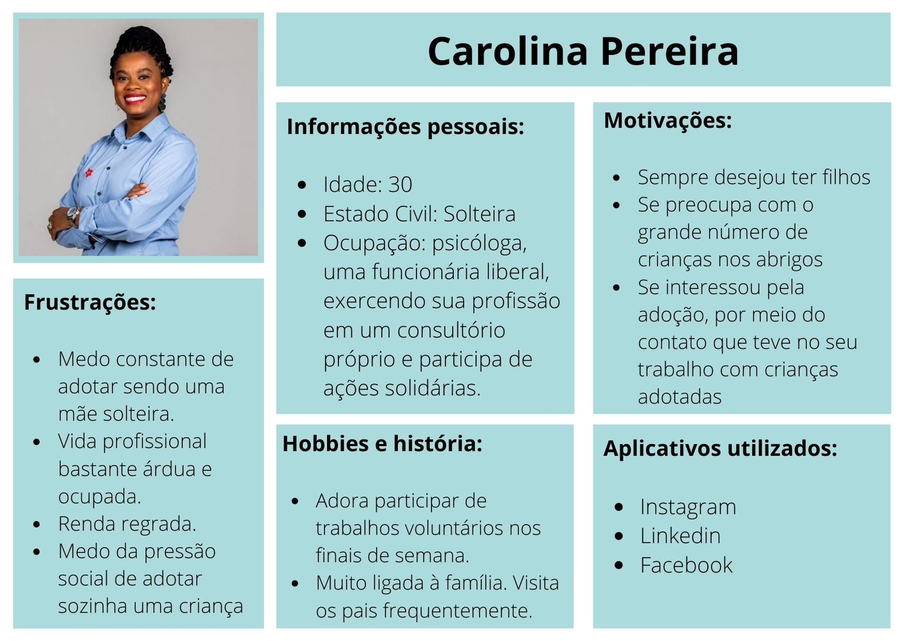

# A.DOTA

**Anna Pugga Campos Rodrigues, anna.campos@sga.pucminas.br**

**Bárbara Luiza Freitas Carmo, babi.carmo@outlook.com**

**Luiza Ribeiro Parente Silva, luizarparentesilva@gmail.com**

---

_Curso de Ciência da Computação, Unidade Coração Eucarístico_

_Instituto de Informática e Ciências Exatas – Pontifícia Universidade de Minas Gerais (PUC MINAS), Belo Horizonte – MG – Brasil_

---

_**Resumo**_ 
_Considerando os trantornos causados pela morosidade atual nos processos de adoção no Brasil, foi de interesse da equipe continuar o desenvolvimento de uma plataforma para controle das etapas, documentações e experiências presentes no decorrer de um processo adotivo. Visa-se facilitar o controle passo a passo do mesmo através de um suporte informativo e interativo sobre quais são os documentos e ações necessários em cada etapa, possibilitando maior controle e organização, além de propor a interação entre adotantes atuais e aqueles que já vivenciaram esta experiência._

---

**1. Introdução**
 
No país em que vivemos, o acesso a informações confiáveis é muitas vezes dificultado. Este pode ser um problema em contextos extremamente diversos, inclusive no processo de adoção, tendo em vista que muitos dos interessados em adotar não têm suporte suficiente para se orientarem de forma clara.

De acordo com entrevistas realizadas posteriormente e um recente contato com uma advogada especialista, saber quais são os documentos necessário para formalizar uma adoção no Brasil, onde obtê-los e suas funções no processo é algo complicado para os futuros pais e mães. Infelizmente, mesmo depois de tantos anos, as adoções no país continuam sendo demasiadamente burocráticas e demoradas, o que interfere diretamente no sucesso das mesmas. Considerando que a equipe não pode modificar diretamente os processos jurídicos que permeiam a formalização das adoções, foi necessário adotar uma nova perspectiva acerca do problema.  

Desta forma, passou-se a propor um ambiente digital que facilite o acesso às informações necessárias, como, por exemplo, quais são os documentos e onde conseguí-los, juntamente com a possibilidade de um intercâmbio de experiências por meio de um fórum para que quem ainda esteja passando pelo processo consiga tirar dúvidas com quem já o finalizou.

    1.1 Contextualização
O projeto se trata de uma plataforma que integra conhecimentos de desenvolvimento web, banco de dados e sistemas inteligentes com o intuito de instruir e facilitar os processos daqueles que pretendem realizar uma adoção. Segundo o Cadastro Nacional de Adoção, em 2019 foram registradas 9.548 crianças e adolescentes estão na fila para a adoção e o número de interessados em adotar é cerca de quatro vezes maior, porém, a morosidade do processo e algumas questões de preferência impedem que estes processos tenham sucesso.

    1.2 Problema
Conforme explicitado, no país em que vivemos, a burocracia e a ineficácia do sistema pelo qual é implementado o processo de adoção acaba forçando esses casais a esperar muito mais tempo do que seria necessário até que consigam algum avanço no procedimento.

Devido à má implementação, ao excessivo tempo de espera, à legislação precária e a muitos outros fatores, os cônjuges que têm a intenção de adotar sofrem com a morosidade do sistema proposto pelo governo brasileiro.

    1.3 Objetivo geral
Frente ao problema salientado, procurou-se utilizar os recursos tecnológicos a disposição para criar um ambiente online que ajude os futuros pais e mães a orientarem-se durante essa jornada burocrática. Ademais, empenhar-se-á na tarefa de oferecer recursos além dos oferecidos pelo programa governamental, permitindo aos usuários o usufruto de artifícios que permitam maior liberdade aos que buscam sucesso na adoção, inserindo-os diretamente no processo, e, permitindo maior transparência no procedimento.

        1.3.1 Objetivos específicos
Dentre os objetivos específicos da equipe A.dota podemos citar a intenção de expandir os conhecimentos e o acesso à informações sobre o assunto para os adotantes e a concepção de um ambiente que possibilite organizar, controlar e acompanhar o andamento do processo. Para isso o ambiente A.dota conta com diversos materiais de apoio como vídeos, depoimentos, acesso a leis, sites governamentais, especificação dos processos passo a passo e controle interativo e personalizado das estapas concluídas, em andamentos e futuras.

    1.4 Justificativas
Considerando que o Brasil tem atualmente 4,9 mil crianças e adolescentes no sistema de  adoção, de acordo com pesquisa realizada pela Agência Brasil, mas que cada processo iniciado pode demorar anos para ser efetivado, propôs-se a busca por soluções que possam facilitá-los por meio dos conhecimentos da equipe acerca da área de desenvolvimento de software, sistemas inteligentes e banco de dados.

**2. Projeto da Solução**

Durante o processo de desenvolvimento, todos os membros das equipes tiveram contato direto com pais que já haviam adotado e/ou casais que estavam interessados no assunto. Dessa maneira, a partir da análise das inúmeras dificuldades enfrentadas por esses pais, foi possível visualizar a realidade dura e cruel do atual procedimento de adoção. A partir desta análise, juntamente com nossos conhecimentos programacionais, foi possível desenvolver um planejamento para o que viria a ser nossa solução para este problema.

    2.1. Personas 

As personas levantadas durante o processo de entendimento do problema são apresentadas na figuras a seguir:

    2.2. História de usuário

A partir da compreensão do dia a dia das personas identificadas para o projeto, foram verificadas as seguintes histórias de usuários:

| Eu como persona... | ...quero/desejo... | ...para |
| ------------------ |:------------------:| -------:|
| João Alberto | ter mais informações sobre adoção | ter certeza da minha decisão |
| João Alberto | saber quais são os passos a serem seguidos | conseguir me organizar melhor |
| João Alberto | não precisar sempre entrar em contato com o advogado | poupar tempo e esforço |
| Carolina Pareira | conseguir acompanhar meu processo com mais clareza | me organizar melhor |
| Carolina Pareira | conhecer a documentação necessária e onde conseguí-la | agilizar meu processo |
| Carolina Pareira | ter acesso a conteúdos diversos sobre o assunto | me interar sobre o tema |

    2.3. Requisitos funcionais
	
A tabela a seguir apresenta os requisitos do projeto, identificando a prioridade de cada um.

| No.           | Descrição                                         | Prioridade |
| ------------- |:-------------------------------------------------:| ----------:|
| RF-01         | O site apresenta uma versão clássica e outra otimizada especificamente para dispositivos móveis (web app).    | Alta  |
| RF-02         | O site oferece uma plataforma de cadastro, que permite que cada usuário seja direcionado para a criação de seu perfil.    | Alta  |
| RF-03         | O site oferece informações detalhadas sobre o processo de adoção. | Alta  |
| RF-04         | O site permite a checagem do andamento do processo de adoção de cada usuário. | Alta  |
| RF-05         | O site, por meio das informações disponibilizadas pelo usuário, desbloqueia processos quando as tarefas são finalizadas.  | Alta  |
| RF-06         | O site apresenta a documentação necessária para cada etapa do processo de adoção, explicando cada uma.    | Alta  |
| RF-07         | O site indica os locais e os órgãos responsáveis pela emissão de cada documento.  | Alta  |
| RF-08         | A cada etapa concluída, o site indica os próximos passos a serem seguidos em relação às documentações.    | Alta  | 
| RF-09         | O site apresenta veículos de comunicação em que o usuário pode expressar dúvidas. | Baixa |
| RF-10         | O site permite que o usuário interaja com um chatbot para tirar dúvidas.   | Baixa |    
| RF-11         | O site oferece acesso a vídeos e notícias sobre a adoção no Brasil.   | Baixa |    
| RF-12         | O site informa algumas leis importantes sobre o tema e direciona aos órgãos especializados.   | Baixa |    

    2.4. Requisitos não funcionais

A tabela a seguir apresenta os requisitos não funcionais do projeto e suas prioridades indicadas.

| No.           | Descrição                                         | Prioridade |
| ------------- |:-------------------------------------------------:| ----------:|
| RNF-01    | O site está acessível na Internet por meio da hospedagem na plataforma Heroku.  | Alta |
|RNF-02     | O site é compatível com os principais navegadores do mercado (Google Chrome, Firefox, Microsoft Edge)  | Alta |
| RNF-03    | O site é responsivo, se adequando há diferentes tamanhos de telas.  | Média |
| RNF-04    | O site é instalável nos principais sistemas operacionais mobile (Android e IOS).  | Alta |

    2.5. Restrições

As questões que limitam o projeto em questão são apresentadas na tabela a seguir

| No.           | Descrição                                         |
| ------------- |:-------------------------------------------------:|
| RE-01     | O site não atua diretamente na burocracia do processo de adoção |
| RE-02     | O site não tem controle dos prazos |
| RE-03     | Mesmo servindo de apoio, o aplicativo não substitui a presença de um advogado. |

    2.6. Tecnologias e ambiente de trabalho

Com relação à gestão do código fonte, o grupo de desenvolvimento, após fazer suas alterações no projeto, faz a commit na branch master do repositório do GitHub. Após a confirmação de sucesso e isenção de falhas nessa commit, é feito o push para o Heroku, pelo qual será exibido o site ao usuário final.

Estão listadas abaixo as tecnologias, ferramentas e ambientes utilizados para o desenvolvimento do projeto A.dota especificadas por finalidade e utilização:

* Linguagens de desenvolvimento web front-end: HTML, CSS e JavaScript;
* Linguagens de desenvolvimento back-end: Java;
* Repositório: GitHub; 
* Frameworks: Bootstrap, MDB e Spark;
* Integração BD com o site: Eclipse, Maven; 
* Banco de dados: PostgreSQL;
* IDE web: Microsoft Visual Studio Code;
* Service Worker para permitir ao smartphone reconhecer o site como app;
* Microsoft Azure como servidor em nuvem para o banco de dados e fornecendo a API para o ChatBot;
* QnA Maker para reunir e formular perguntas e respostas do ChatBot.

Como citado acima, para o desenvolvimento base de nossa aplicação web foram utilizadas linguagens de front-end e back-end através do Microsoft Visual Studio Code, montando uma aplicação com diversas páginas e funcionalidades. A partir daí, foi possível integrar as informações dos usuários com o banco de dados da A.dota no PostgreSQL através da Eclipse e Maven. Além disso, foram utilizadas as plataformas QnA Maker e Microsoft Azure como base para a criação do ChatBot.

A imagem a seguir demonstra a relação estabelecida entre as principais tecnologias e ambientes utilizados para a elaboração, desenvolvimento e finalização do projeto A.dota:

    2.7 Metodologia de trabalho

Neste projeto utilizou-se a metodologia Scrum, que consiste em dividir sendo cada um responsável por uma parte predefinida do projeto, delimitando, assim, o que cada parte do grupo faz, simplificando os testes e desenvolvimento mais aperfeiçoado das funcionalidades. Além disso, para o desenvolvimento do sistema, partiu-se do ciclo sprint, que consiste em analisar o que precisa ser feito, implementá-las no produto, revisar e testar.

Outro pilar do Scrum, o Product Backlog foi aplicado no gerenciamento das tarefas, o qual consiste na criação de uma lista de funcionalidades necessárias para o projeto, tornando-se mais simples a análise de quais partes são mais importantes e que merecem maior enfoque. 

Como a equipe da A.dota é composta de três integrantes, a função de desenvolvedor foi desempenhada por todos os membros, porém, atuando em partes diferentes. A equipe está organizada da seguinte maneira:
* _Scrum Master: Luiza Ribeiro_ -> Mantém a equipe em uma sintonia e fiscaliza o andamento do produto e do segmento do Scrum.
* _Product Owner: Anna Puga_ -> Chefe de criação do software. Coordena o desenvolvimento sugere melhorias a serem feitas no produto, além de identificar os problemas da aplicação.
* _Equipe de Desenvolvimento: Anna Puga, Bárbara Carmo, Luiza Parente_ -> Trabalham no desenvolvimento do produto em todas as partes, principalmente onde cada um tem mais facilidade.
* _Equipe de Design: Bárbara Carmo_ -> Trabalha no design das páginas e do aplicativo do produto, tendo em base suas funcionalidades e como estas devem ficar no distribuídos no seu produto, sendo extremamente necessárias do início ao fim, tanto como base para o desenvolvimento como a parte final do mesmo.

**3. Sistema desenvolvido**

A A.dota é uma plataforma para controle do processo adotivo, como já especificado anteriormente. Nela estão reunidos conhecimentos de desenvolvimento web, sistemas inteligentes e banco de dados de forma interligada. Sua estrutura básica é um site, hospedado pelo Heroku, no qual os usuários cadastrados tem suas informações gerenciadas através de um banco de dados e para melhorar a experiênia dos adotantes, foi implementado um ChatBot, de nome A.Lice, que responde as principais dúvidas sobre o processo adotivo.

É possível encontrar na A.dota, notícias, vídeos, depoimentos, leis, detalhamento dos passos dentro do processo de adoção, a possibilidade de enviar um e-mail para nossa equipe, um chat social e os serviços da A.Lice, ChatBot responsável por sanar as principais dúvidas dos adotantes.
	
    3.1 Wireframes e fluxo
O esquema e os wireframes a seguir representam parte do fluxo de utilização do A.dota e suas funcionalidades em sua fase de prototipação, ou seja, foram desenvolvidas para ilustrar e orientar como o site viria a ser. Estas foram desenvolvidas na plataforma MarvelApp e podem ser visualizadas em sua forma interativa a partir do link: https://marvelapp.com/prototype/7770i1b

A explicação do objetivo e funcionalidades de cada tela serão explicados já em sua visualização final como aplicação web.

    3.2 Telas do sistema
<!-- Pendente -->

**4. Modelagem de dados**
<!-- Mudar. -->
Para o funcionamento da aplicação, foi necessário uma estrutura que comportasse os dados dos usuários, os respectivos processos pelos quais cada usuários passa e as tarefas que compões cada processo. Com esta finalidade doi criada a base de dados que é conectada diretamente com o site, tornando a interação do usuário com o sistema funcional e personalizada.

<!-- Apresente o modelo de dados. Defina o dicionário de dados com os respectivos formatos e significados. -->

    3.1. Diagrama de Entidade-Relacionamento
<!-- Mudar. -->
O diagrama abaixo ilustra a estrutura base para o funcionamento do nosso sistema. Nele podemos observar as entidades Usuario, Processo e Tarefa que estão ligadas entre si de forma que, um usuário passa por vários processos e cada processo tem várias tarefas.

**5. Serviços inteligentes**

Neste projeto foi desenvolvido um ChatBot - software capaz de receber mensagens escritas ou por voz, interpretar seu conteúdo e oferecer respostas adequadas - apelidado de A.Lice. Ela tem como objetivo responder dúvidas de participantes do processo adotivo cadastrados no sistema da A.dota com a mesma fluidez de um agente humano do Conselho Nacional de Justiça, encarregado pelo Cadastro Nacional de Adoção. Desta forma, a aplicação poderá assistir diversas famílias em uma quantidade mínima de tempo, assegurando uma resposta com alto nível de acurácia, melhorando a experiência ofertada pela aplicação como um todo.

    5.1 Intelligent Systems Canvas

Para desenvolvimento do ChatBot A.lice, sendo um Sistema Conversacional, foi utilizada a metodologia Intelligent Systems Canvas (IS Canvas), projetado para visualização da proposta da aplicação, como especificado a seguir:

    5.2 Fluxo de diálogo

A A.Lice foi desenvolvida a partir do Fluxo de Diálogo especificado pela equipe A.dota. A A.Lice conta com entradas de dados sobre adoção retirados de sites e consultas jurídicas, tais como o site do Tribunal Federal de Justiça. Dessa forma, é possível oferecer respostas plausíveis e bem fundamentadas.

Para demonstrar o fluxo de diálogo entre o ChatBot implementado e o usuário, foi utilizada a ferramenta BotMock. Através dela foi possível simular uma conversa entre a A.Lice e um adotante. A imagem a seguir representa o fluxo proposto, entretanto, como a visualização pode ser comprometida devido às restrições da imagem, um pdf do mesmo se encontra nesta mesma pasta (https://github.com/icei-pucminas/ti2-cc-abcl/tree/master/documentacao)

    5.3 Implementação

O primeiro passo foi reunir conteúdo para formar a base de dados com a qual o ChatBot iria trabalhar. Para isso foram selecionados, links de sites do governo, - tais como o site do Tribunal Federal de Justiça e do Conselho Nacional de Justiça  - cartilhas com as principais dúvidas, fóruns sobre o tema e outras fontes confiáveis que nos possibilitaram ter informações suficientes para que, através da aplicação QnA Maker, fossem formuladas as perguntas e respostas utilizadas no ChatBot.

A partir deste ponto foi possível criar, através da aplicação Microsoft Azure, o ChatBot que apelidamos de A.Lice. Para proporcionar uma melhor experiência, as perguntas foram sendo testadas e a partir dos resultados, a base foi sendo atualizada e/ou modificada. Assim que resultados satisfatórios foram obtidos, a API da Microsoft Azure responsável pelo ChatBot foi inserida no projeto A.dota.

**6. Avaliação**
<!-- Refazer. -->
O processo de realização dos testes da solução foi desenvolvida fazendo o uso da metodologia “Rápida e Suja”, sendo essa uma forma simples e breve, porém eficaz, de realizar testes em uma aplicação, baseando-se na técnica de observação do usuário.

<!-- Faça aqui sobre a avaliação do software. Indique se ele atendeu as expectativas e ele é viável. 
Para não ficar subjetivo, o ideal é fazer um questionário e pedir ao usuário do processo que faça a avaliação. -->

| Usuário       | Registro do resultado                             |
| ------------- |:-------------------------------------------------:|
| Usuário #1 ~ 50 anos | O resultado dos testes do sistema foram satisfatórios, com o usuário obtendo sucesso em quase todas as tarefas do sistema, tendo apenas dificuldades em saber quando fazer login ou quando cadastrar. |
| Usuário #2 - menos de 20 anos | O teste obteve resultados satisfatórios. O usuário não apresentou nenhuma dificuldade em realizar o cadastro pelo site ou em responder o questionário, conseguindo compreender o que foi solicitado com clareza. |
| Usuário #3 - entre 20 e 30 anos | O teste realizado obteve resultados positivos. O usuário foi capaz de realizar todo o procedimento necessário para ingressar ao sistema sem nenhuma dificuldade. |
| Usuário #4 - entre 50 e 60 anos | O teste apresentou resultados positivos, mas o usuários teve certo impasse ao navegar pela primeira vez nas funcionalidades propostas pelo aplicativo, ficando com dúvidas de como prosseguir a navegação. No entanto, o usuário foi capaz de usufruir da aplicação. |
| Usuário #5 - menos de 20 anos | O teste obteve resultados satisfatórios, o usuário foi capaz de realizar o cadastro e responder todo o questionário sem nenhuma dificuldade, compreendendo o objetivo proposto pela site. |
| Usuário #6 - entre 20 e 30 anos | O teste obteve excelentes resultados. O usuário conseguiu realizar seu cadastro com clareza sem nenhuma dúvida. Elogiou o site e seu manejo e conseguiu realizar todas as funções pedidas. |
| Usuário #7 ~ 50 anos | A utilização do site foi bem sucedida, tendo sido bem explicado o que fazer no cadastro e perguntas de fácil entendimento no questionário. |
| Usuário #8 ~ 40 anos | O usuário realizou seus primeiros passos de maneira lenta mas depois se adaptou e entendeu como funcionava a plataforma e conseguiu de maneira clara realizar seu cadastro. Fez comentários positivos sobre o site e conseguiu navegar por ele sem dificuldades. |

**7. Conclusão**
<!-- Pendente. -->

Apresente aqui a conclusão do seu trabalho. Discussão dos resultados obtidos no trabalho, onde se verifica as 
observações pessoais de cada aluno. Poderá também apresentar sugestões de novas linhas de estudo.

**REFERÊNCIAS**

**[1.]** - _Littlefield, A. **Guia da metodologia ágil e scrum para iniciantes**. 2016. Disponível em: https://blog.trello.com/br/scrum-metodologia-agil._

**[2.]** - _Gigante, E. A. **Como funciona o processo de adoção no brasil?**. 2018. Disponível em: https://www.politize.com.br/adocao-no-brasil/._

**[3.]** - _Albuquerque, F. **Adoção sempre foi difícil no Brasil, diz advogada**. 2016. Disponível em: https://agenciabrasil.ebc.com.br/direitos-humanos/noticia/2016-10/tema-da-adocao-sempre-foi-dificil-no-brasil-cadastros-dificultam._

**[4.]** - _Pignato, C.; Zanlorenssi, G.; Ostetti, V. **Adoção no Brasil: perfil de crianças e pretendentes e como funciona o processo**. 2018. Disponível em https://www.nexojornal.com.br/grafico/2017/08/11/Ado%C3%A7%C3%A3o-no-Brasil-perfil-de-crian%C3%A7as-e-pretendentes-e-como-funciona-o-processo._

**[5.]** - _Reis, T. **Demora da Justiça faz criança perder chance de adoção, mostra estudo.**. 2015. Disponível em: http://g1.globo.com/bemestar/noticia/2015/06/demora-da-justica-faz-crianca-perder-chance-de-adocao-mostra-estudo.html._

**[6.]** - _Governo de Minas Gerais. **Adotar criança ou adolescente.**. 2020. Disponível em: https://www.mg.gov.br/servico/adotar-crianca-ou-adolescente_

**[7.]** - _Grupo Acesso – Estudos, Pesquisa e Intervenção em Adoção. **Cartilha passo a passo - Adoção de Crianças e Adolescentes no Brasil.**. 2020. Disponível em: https://www.defensoria.pb.def.br/criative/Documentos/Cartilha-adocaopassoapasso.pdf_

**[8.]** - _Corregedoria Nacional de Justiça. **Passo a passo da adoção.**. 2019. Disponível em: https://www.mg.gov.br/servico/adotar-crianca-ou-adolescente_

**[9.]** - _Tribunal de Justiça do Estado de Minas Gerais. **Adoção de crianças e adolescentes.**. 2020. Disponível em: https://www.tjmg.jus.br/portal-tjmg/servicos/adocao.htm#.X72humhKjIV_

**[10.]** - _Tribunal de Justiça do Estado de Minas Gerais. **Passo a passo para adoção, segundo o CNJ.**. 2020. Disponível em: https://www.tjmg.jus.br/portal-tjmg/servicos/passo-a-passo-para-adocao-segundo-o-cnj.htm#.X72hvWhKjIV_
